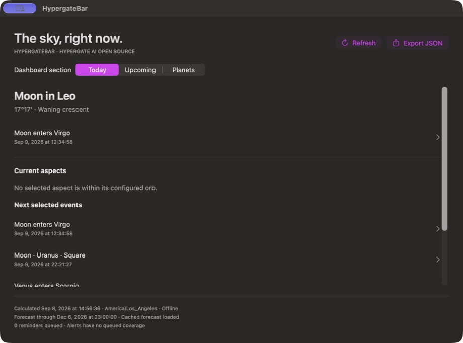

# HypergateBar

**Hypergate AI Open Source** — native macOS menu-bar astrology, calculated offline.

[Website](https://hypergate-bar.vercel.app/) · [Changelog](https://hypergate-bar.vercel.app/changelog/) · [Website development](website/README.md)

Unreleased source implementation for macOS 14+, initially validated on Apple Silicon/macOS 27. No account, backend, AI model, paid API, telemetry, birth information, or location permission is required. No public binary release is available yet.



## Features

- Real tropical geocentric positions and motion for all ten bodies, Moon sign/phase and next ingress.
- Ingresses, squares, oppositions, stations, optional conjunctions/minor aspects, and a progressive cached 90-day forecast.
- Native Today, Upcoming and Planets dashboards, event details with UTC, filters, display zones, Settings and save-dialog JSON export.
- Local reminders with editable leads, type/body filters, quiet hours, pause and sound. Alerts and launch at login start off.
- Foundation-only calculation package, replaceable provider adapter, CLI and versioned JSON.
- Menu-bar update indicator and versioned Update action, with user-controlled automatic checks in configured publisher builds.

Independent tests compared 1,040 positions and 88 representative events against JPL Horizons. All frozen gates passed for those samples. Input range: 2000-01-01 through 2050-12-31 UTC. See [accuracy and limits](docs/accuracy.md); this is sampled validation, not exhaustive event-topology proof.

## Build and run

Requires Xcode with Swift 6, macOS SDK/command-line tools, Python 3 and Git. The committed Xcode project builds without XcodeGen or an Apple Developer account. Initial resolution downloads pinned Sparkle 2.9.6; core operation and routine tests are offline afterward. XcodeGen 2.45.4 is needed only for project regeneration.

```sh
git clone https://github.com/theleoking-astrology/hypergate-bar.git
cd hypergate-bar
make check
make test
make run
make package-local
```

`script/build_and_run.sh --dashboard` opens Dashboard immediately. Builds stage exact source bytes under a project-specific `~/Library/Caches/HypergateBar` directory to avoid FileProvider signing metadata; `HYPERGATE_BUILD_PATH` overrides it. The Codex Run action uses the same script.

Closing Dashboard leaves the menu-bar application running. Quit exits. Removing the menu item may cause macOS to terminate a menu-bar-only application; reopen HypergateBar from Finder to restore access. Command-comma opens Settings.

Local packaging creates an **ad-hoc signed development ZIP**, checksums, notices and source manifest under `dist/`. It is not notarized. `make release` fails closed without publisher configuration and protected execution: [release runbook](docs/release-runbook.md).

## CLI and reuse

```sh
swift run --package-path Packages/HypergateCore hypergate sky --at 2026-09-08T19:00:00Z --json
swift run --package-path Packages/HypergateCore hypergate events --from 2026-09-08T00:00:00Z --to 2026-10-08T00:00:00Z --types ingress,square,opposition,station --json
swift run --package-path Examples/Consumer
```

These are reproducible usage examples, not claims about the present sky. Dates need explicit offsets; queries are limited to 90 elapsed days. Errors use stderr and nonzero status. See [developer reuse/schema](docs/developer-reuse.md).

## Evidence and limitations

See [validation](docs/validation.md), [performance](docs/performance.md), [checklist](docs/implementation-checklist.md), [conventions](docs/calculations.md), [architecture](docs/architecture.md) and [privacy/network behavior](docs/privacy.md).

The local package run passed 25 tests. Hosted macOS 14/Xcode 16.2 and macOS 26/Xcode 26.6 both passed the source checks, 25 package tests, five application-service tests, actual Dashboard/export/menu-popover/Quit UI test, and development packaging. [Verified run](https://github.com/theleoking-astrology/hypergate-bar/actions/runs/34286260846). Local UI automation remains blocked by this host's test-attachment/automation configuration; local windows were inspected directly. OS scheduling readback reached 44 routine reminders, but visible test delivery and notification-click navigation remain unverified. Focus, sleep, permission and display-sharing policy can suppress delivery. Queue coverage can end before the forecast; replenishment requires the app to run again.

Updates stay disabled without verified publisher configuration. No trusted binary, notarization or updater-delivery claim is made.

## License

Original code: MIT. Preserve [dependency notices](THIRD_PARTY_NOTICES.md). HypergateBar and Hypergate AI Open Source identify this project; forks should use their own identity and must not imply endorsement. Attribution does not restrict the MIT software license. See [CONTRIBUTING](CONTRIBUTING.md), [SECURITY](SECURITY.md) and [CODE_OF_CONDUCT](CODE_OF_CONDUCT.md).
